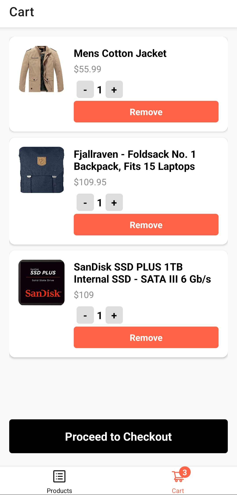

# React Native E-Commerce App

This is a React Native e-commerce app using Expo that features product listing, product details, cart functionality, and simulated API fetching.

## Screenshots

|                                          |                                          |                                          |
| ---------------------------------------- | ---------------------------------------- | ---------------------------------------- |
|  |  |  |
|                                          |                                          |                                          |

## Features

- **Product Listing**: Displays a list of products in a grid layout.
- **Product Details**: Shows detailed information about a selected product.
- **Cart Functionality**: Allows users to add products to the cart, view cart items, and adjust quantities.
- **Checkout**: Provides a checkout form for entering user details and processing payments.

## Technologies Used

- **React Native**: For building the mobile app.
- **Expo**: For development and testing.
- **Context API**: For state management.
- **AsyncStorage**: For persisting cart data.
- **Expo Router**: For handling navigation.

## Getting Started

To get started with this project, follow the steps below:

### Prerequisites

- **Node.js**: Ensure Node.js is installed. You can download it from [nodejs.org](https://nodejs.org/).

### Cloning the Repository

1. Clone the repository:

   ```bash
   git clone https://github.com/yousefwahba/commerce.git
   ```

### Installing Dependencies

Navigate to the project directory and install the dependencies using npm or yarn:

```bash
npm install
```

### Running the App

1. **Start the Expo development server**:

   ```bash
   npx expo start --tunnel
   ```

2. **Open the app in Expo Go**:
   - Install the Expo Go app from the [App Store](https://apps.apple.com/us/app/expo-go/id982107779) (iOS) or [Google Play Store](https://play.google.com/store/apps/details?id=host.exp.exponent&hl=en&gl=US) (Android).
   - Scan the QR code displayed in the terminal or on the Expo Developer Tools in your browser.

### Project Structure

Here's an overview of the project's directory structure:

| Directory/File | Description                                                                                                   |
| -------------- | ------------------------------------------------------------------------------------------------------------- |
| `components/`  | Contains reusable components like `ProductItem`, `CartItem`, and `Checkout`.                                  |
| `constants/`   | Contains mock data and types used in the project.                                                             |
| `context/`     | Contains context providers for managing cart state.                                                           |
| `screens/`     | Contains the main screens like `ProductList` and `ProductDetails`.                                            |
| `App.tsx`      | Entry point of the application and router folder contain all routes like `ProductList` and `ProductDetails` . |
| `package.json` | Contains project metadata and dependencies.                                                                   |

---
